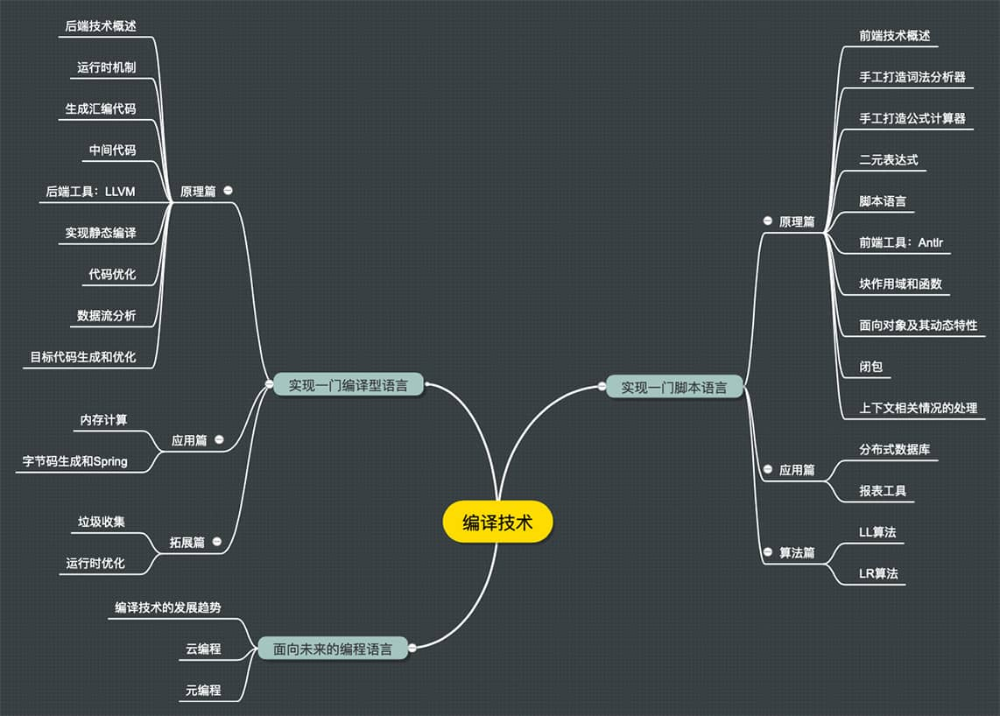

《编译原理之美》笔记

------

[《编译原理之美》](https://time.geekbang.org/column/intro/219 )学习笔记。

编译技术应用的一些场景：

- 编写界面模板引擎； 

- 为项目编写各种各样的 DSL； 

- 深度理解甚至编写 Spring、Hibernate、阿里巴巴 Druid这样的工具

### 为什么要学习编译原理？

编译技术是计算机科学皇冠上的明珠之一。历史上各门计算机语言的发明人，总是被当作英雄膜拜。

很多软件都具备二次编程能力，如Office、CAD、GIS、Mathematica 等等。谷歌、苹果、微软等技术巨头的核心能力，都是拥有自己的**语言和生态**。

#### 编译技术，与你的工作息息相关

作为程序员，**在实际工作中你经常会碰到需要编译技术的场景。**

JAVA中的**Hibernate** 和 **Spring**，前者用到了编译技术做**HQL**的解析，后者对注解的支持和字节码动态生成也属于编译技术。

PHP程序员一般会用到**模板引擎**实现界面设计与代码的分离。如果你了解编译技术，会更容易掌握这些模板引擎，甚至写出更符合领域需求的模板引擎。

需要**用户自定义功能**的软件，比如**报表软件**、**工资管理软件**等，都需编译技术。

编写一个**基础设施类**的软件，比如**数据库软件**、**ETL软件**、大数据平台等，很多需要采用编译技术提供软件自带的语言功能，比如 SQL。这种功能<u>无法由外部通用语言实现</u>。

### 课程介绍和目录

#### 一、实现一门脚本语言

通过具体实例，了解**词法分析**、**语法分析**、**语义分析**（编译器前端技术）的原理，实现一门脚本语言，并用工具提升效率。

#### 二、实现一门编译型语言

了解**如何生成目标代码**和**对代码进行优化**（编译器后端技术），并引入 **LLVM** 工具，**最后生成可执行的文件能支持即时编译，并经过了多层优化。**

#### 三、面向未来的编程语言

人工智能与编译技术结合是否会出现人工智能编程？这部分是对编译技术发展趋势的一些分析，**更好地把握未来技术发展的脉搏。**