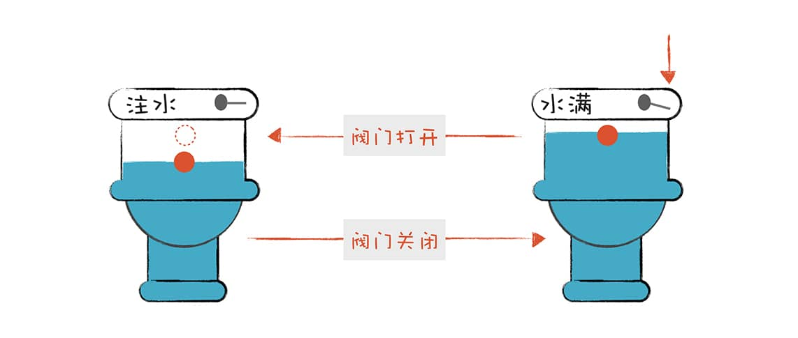
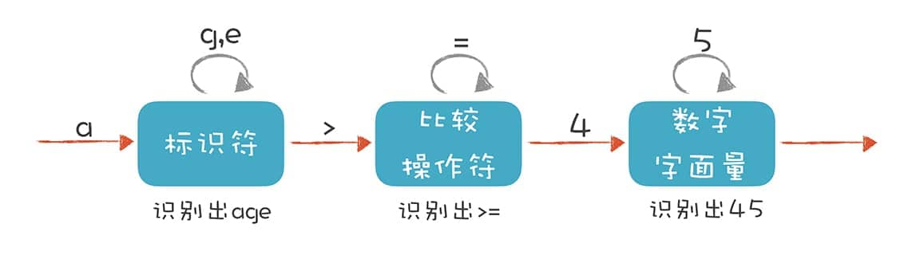
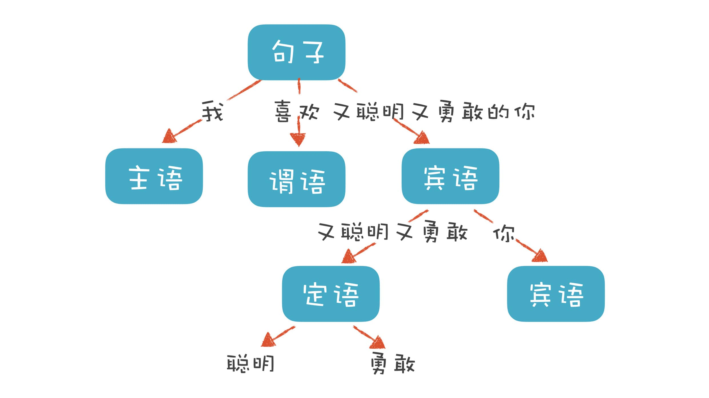

## 01-理解代码：编译器的前端技术

**这里的“前端（Front End）”指的是编译器对程序代码的分析和理解过程**。它通常只跟语言的语法有关，跟目标机器无关。而与之对应的**“后端（Back End）”则是生成目标代码的过程，跟目标机器有关**。


### 词法分析（Lexical Analysis）

**“词法记号”**（Token），类似文章中的单词。

```c
#include <stdio.h>
int main(int argc, char* argv[]){
    int age = 45;
    if (age >= 17+8+20) {
        printf("Hello old man!\\n");
    }
    else{
        printf("Hello young man!\\n");
    }
    return 0;
}
```

上面代码中有`if`、 `else`、 `int`等关键词，`main`、`printf`、`age`等标识符，`+`、`-`、`=`等操作符号，还有花括号、圆括号、分号等符号，以及数字字面量、字符串字面量等。这些都是**Token**。

如何用程序识别Token呢？ 这和汉语**“分词”**有点类似。

首先，指定规则区分Token：

- **识别 age 这样的标识符。**它以字母开头，后面可以是字母或数字，直到遇到第一个既不是字母又不是数字的字符时结束。
- **识别 >= 这样的操作符。** 当扫描到一个 > 字符的时候，就要注意，它可能是一个 **GT**（Greater Than，大于）操作符。但由于 **GE**（Greater Equal，大于等于）也是以 > 开头的，所以再往下再看一位，如果是 =，那么这个 Token 就是 GE，否则就是 GT。

- **识别 45 这样的数字字面量。**当扫描到一个数字字符的时候，就开始把它看做数字，直到遇到非数字的字符。

这些规则可以通过手写程序来实现。事实上，很多编译器的词法分析器都是手写实现的，例如 GNU 的 C 语言编译器。

除了手写实现，也可以用词法分析器的生成工具来生成，比如 **Lex**（或其 GNU 版本，**Flex**）。这些生成工具是基于一些规则来工作的，这些规则用“**正则文法**”（Regular Grammar）表达，符合正则文法的表达式称为“正则表达式”。生成工具可以读入正则表达式，生成一种叫“**有限自动机**”的算法，来完成具体的词法分析工作。

有限自动机是有限个状态的自动机器。以抽水马桶为例，它分为两个状态：“注水”和“水满”。摁下冲马桶的按钮，它转到“注水”的状态，而浮球上升到一定高度，就会把注水阀门关闭，它转到“水满”状态。



词法分析器也是一样，它分析整个程序的字符串，当遇到不同的字符时，会驱使它迁移到不同的状态。例如，词法分析程序在扫描 age 的时候，处于“标识符”状态，等它遇到一个 > 符号，就切换到“比较操作符”的状态。**词法分析**过程，就是这样一个个**状态迁移**的过程。



### **语法分析 （Syntactic Analysis, or Parsing）**

词法分析是识别一个个的单词，而语法分析就是在词法分析的基础上识别出程序的**语法结构**。这个结构是一个**树状**结构，是计算机容易理解和执行的。

以自然语言为例。比如，自然语言有定义**良好的语法结构**，“我喜欢又聪明又勇敢的你”这个句子包含了“主、谓、宾”三个部分。主语是“我”，谓语是“喜欢”，宾语部分是“又聪明又勇敢的你”。其中宾语部分又可以拆成两部分，“又聪明又勇敢”是定语部分，用来修饰“你”。定语部分又可以分成“聪明”和“勇敢”两个最小的单位。

这样会得到有一定结构的树。



语法分析过程，就是构造这么一棵树。一个程序就是一棵树，这棵树叫做**抽象语法树**（Abstract Syntax Tree，AST）。树的每个节点（子树）是一个语法单元，这个单元的构成规则就叫“语法”。每个节点还可以有下级节点。

??

### **语义分析（Semantic Analysis）**

语义分析就是要让计算机理解我们的真实意图，把一些模棱两可的地方消除掉。

以“You can never drink too much water.” 这句话为例。它的确切含义是什么？是“你不能喝太多水”，还是“你喝多少水都不嫌多”？实际上，这两种解释都是可以的，我们只有联系上下文才能知道它的准确含义。

你可能会觉得理解自然语言的含义已经很难了，所以计算机语言的语义分析也一定很难。其实语义分析没那么复杂，因为<u>计算机语言的语义一般可以表达为一些规则，你只要检查是否符合这些规则就行了</u>。比如：

- 某个表达式的计算结果是什么数据类型？如果有数据类型不匹配的情况，是否要做自动转换？

- 如果在一个代码块的内部和外部有相同名称的变量，我在执行的时候到底用哪个？ 就像“我喜欢又聪明又勇敢的你”中的“你”，到底指的是谁，需要明确。

- 在同一个作用域内，不允许有两个名称相同的变量，这是唯一性检查。你不能刚声明一个变量 a，紧接着又声明同样名称的一个变量 a，这就不允许了。

语义分析基本上就是做这样的事情，也就是**根据语义规则进行分析判断**。

语义分析工作的某些成果，会**作为属性标注在抽象语法树上**，比如在 age 这个标识符节点和 45 这个字面量节点上，都会标识它的数据类型是 int 型的。

在这个树上还可以标记很多属性，有些属性是在之前的两个阶段就被标注上了，比如所处的源代码行号，这一行的第几个字符。这样，在编译程序报错的时候，就可以比较清楚地了解出错的位置。

做了这些属性标注以后，编译器在后面就可以依据这些信息生成目标代码了，我们在编译技术的后端部分会去讲。

### **课程小结**

- 词法分析是把程序分割成一个个 Token 的过程，可以通过构造有限自动机来实现。

- 语法分析是把程序的结构识别出来，并形成一棵便于由计算机处理的抽象语法树。可以用递归下降的算法来实现。

- 语义分析是消除语义模糊，生成一些属性信息，让计算机能够依据这些信息生成目标代码。

编译过程其实跟你的实际工作息息相关。比如，词法分析就是你工作中使用正则表达式的过程。而语法分析在你解析文本文件、配置文件、模型定义文件，或者做自定义公式功能的时候都会用到。

我还想让你知道，编译技术并没有那么难，它的核心原理是很容易理解的。学习之后，你能很快上手，如果善用一些辅助生成工具会更省事。所以，我希望你通过学习这篇文章，已经破除了一些心理障碍，并跃跃欲试，想要动手做点儿什么了！

