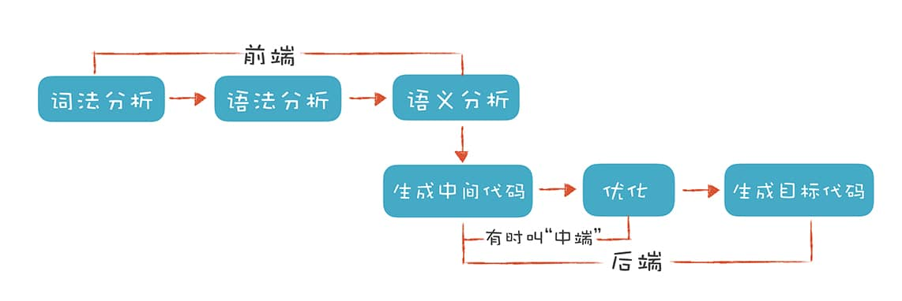

## 01-理解代码：编译器的前端技术

**这里的“前端（Front End）”指的是编译器对程序代码的分析和理解过程**。它通常只跟语言的语法有关，跟目标机器无关。而与之对应的**“后端（Back End）”则是生成目标代码的过程，跟目标机器有关**。



### 词法分析（Lexical Analysis）

**“词法记号”**（Token），类似文章中的单词。

```c
#include <stdio.h>
int main(int argc, char* argv[]){
    int age = 45;
    if (age >= 17+8+20) {
        printf("Hello old man!\\n");
    }
    else{
        printf("Hello young man!\\n");
    }
    return 0;
}
```

上面代码中有`if`、 `else`、 `int`等关键词，`main`、`printf`、`age`等标识符，`+`、`-`、`=`等操作符号，还有花括号、圆括号、分号等符号，以及数字字面量、字符串字面量等。这些都是**Token**。

