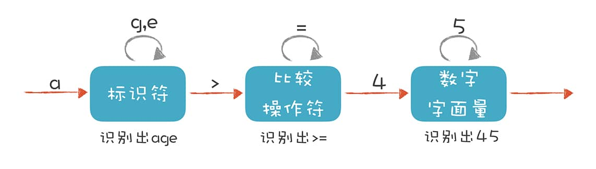
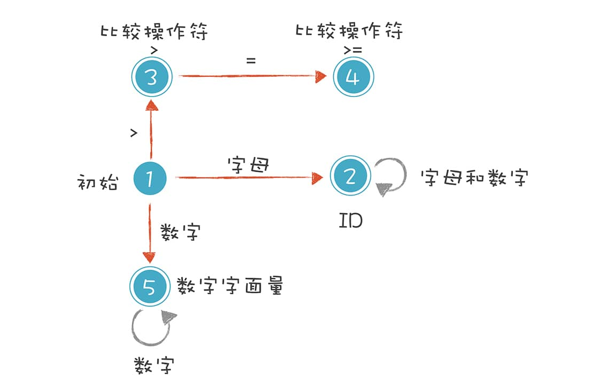
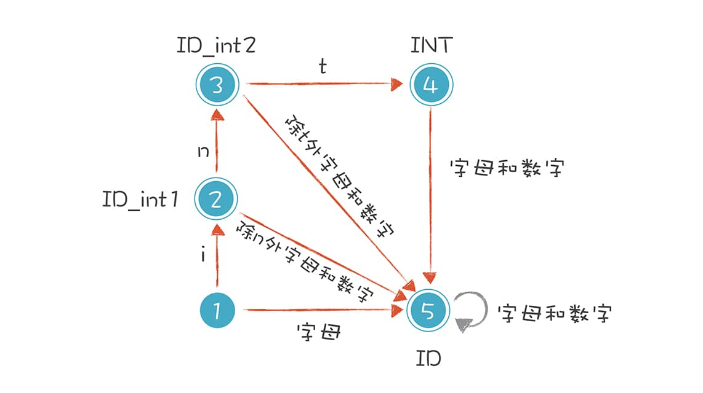

## 2-正则文法和有限自动机：纯手工打造词法分析器

字符串是一连串的字符形成的，怎么把它断开成一个个的 Token 呢？割的依据是什么呢？

正则表达式（Regular Expression）和有限自动机用来解决这些问题。


关系表达式，变量声明和初始化语句，以及算术表达式：

- `age >= 45`

- `int age = 40`

- `2+3*5`


### 解析 age >= 45



Token的一些词法规则：

- **标识符：**第一个字符必须是字母，后面的字符可以是字母或数字。

- **比较操作符：**> 和 >=（其他比较操作符暂时忽略）。

- **数字字面量：**全部由数字构成（像带小数点的浮点数，暂时不管它）。

词法分析程序在遇到 age、>= 和 45 时，会分别识别成标识符、比较操作符和数字字面量。

严格意义上的有限自动机：



上图的 5 种状态。

**1. 初始状态：**刚开始启动词法分析的时候，程序所处的状态。

**2. 标识符状态：**在初始状态时，当第一个字符是字母的时候，迁移到状态 2。当后续字符是字母和数字时，保留在状态 2。如果不是，就离开状态 2，写下该 Token，回到初始状态。

**3. 大于操作符（GT）：**在初始状态时，当第一个字符是 > 时，进入这个状态。它是比较操作符的一种情况。

**4. 大于等于操作符（GE）：**如果状态 3 的下一个字符是 =，就进入状态 4，变成 >=。它也是比较操作符的一种情况。

**5. 数字字面量：**在初始状态时，下一个字符是数字，进入这个状态。如果后续仍是数字，就保持在状态 5。

上图中，圆双线的意思是这个状态已经是一个<u>合法的Token</u> 了，单线的意思是这个状态还是<u>临时状态</u>。

根据5中状态编写成程序(Java)：

```java
DfaState newState = DfaState.Initial;
if (isAlpha(ch)) {              // 第一个字符是字母
    newState = DfaState.Id; // 进入 Id 状态
    token.type = TokenType.Identifier;
    tokenText.append(ch);
} else if (isDigit(ch)) {       // 第一个字符是数字
    newState = DfaState.IntLiteral;
    token.type = TokenType.IntLiteral;
    tokenText.append(ch);
} else if (ch == '>') {         // 第一个字符是 >
    newState = DfaState.GT;
    token.type = TokenType.GT;
    tokenText.append(ch);
}
```

Token 是自定义的一个数据结构，它有两个主要的属性：一个是“type”，就是 Token 的类型，它用的也是一个枚举类型的值；一个是“text”，也就是这个 Token 的文本值。

之后2、3、5 三个状态之后的状态迁移过程：

```java
case Initial:
    state = initToken(ch);          // 重新确定后续状态
    break;
case Id:
    if (isAlpha(ch) || isDigit(ch)) {
        tokenText.append(ch);       // 保持标识符状态
    } else {
        state = initToken(ch); // 退出标识符状态，并保存 Token
    }
    break;
case GT:
    if (ch == '=') {
        token.type = TokenType.GE;  // 转换成 GE
        state = DfaState.GE;
        tokenText.append(ch);
    } else {
        state = initToken(ch);      // 退出 GT 状态，并保存 Token
    }
    break;
case GE:
    state = initToken(ch);        // 退出当前状态，并保存 Token
    break;
case IntLiteral:
    if (isDigit(ch)) {
        tokenText.append(ch);    // 继续保持在数字字面量状态
    } else {
        state = initToken(ch);    // 退出当前状态，并保存 Token
    }
    break;
```

输出结构：

```
Identifier   age
GE           >=  
IntLiteral   45  
```


词法原理，**就是依据构造好的有限自动机，在不同的状态中迁移，从而解析出 Token 来**。只要再扩展这个有限自动机，增加里面的状态和迁移路线，就可以逐步实现一个完整的词法分析器了。

### 初识正则表达式

用更严谨的表达方式描述词法规则（之前用了自然语言），就是**正则表达式**。

上面四种Token用正则表示就是：

```
Id :        [a-zA-Z_] ([a-zA-Z_] | [0-9])*
IntLiteral: [0-9]+
GT :        '>'
GE :        '>='
```

正则中一些符号含义：


### 解析 int age = 40，处理标识符和关键字规则的冲突

词法规则用正则表达式写出来是：

```
Int:        'int'
Id :        [a-zA-Z_] ([a-zA-Z_] | [0-9])*
Assignment : '='
```





### 解析算术表达式

