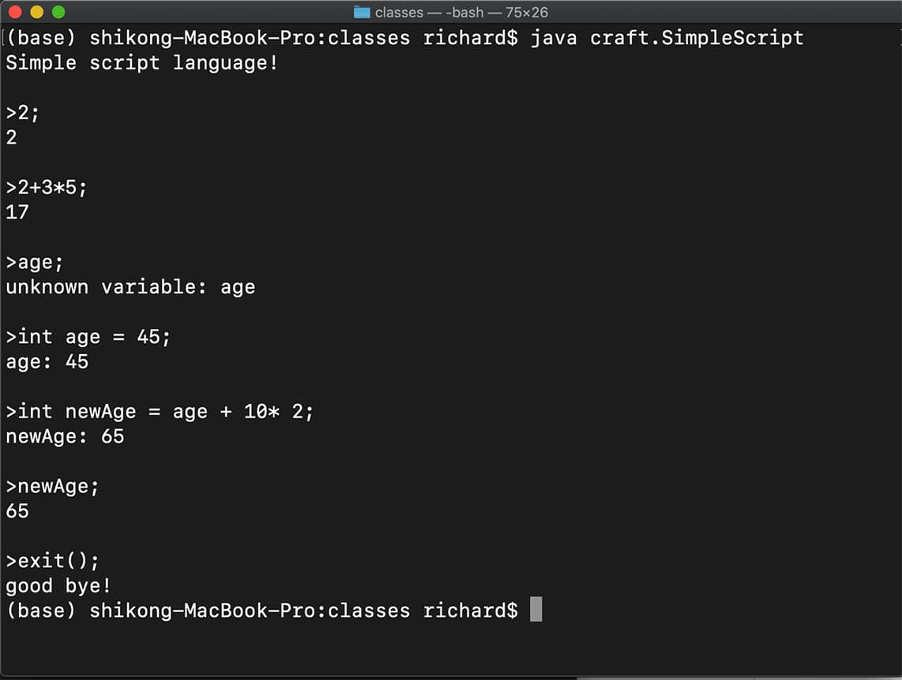

## 05-语法分析（三）：实现一门简单的脚本语言

实现更多的功能，比如：

- 支持变量声明和初始化语句，就像“int age” “int age = 45”和“int age = 17+8+20”；

- 支持赋值语句“age = 45”；

- 在表达式中可以使用变量，例如“age + 10 *2”；

- 实现一个命令行终端，能够读取输入的语句并输出结果。

实现这些功能之后，我们的成果会更像一个脚本解释器。而且在这个过程中，我还会带你巩固语法分析中的递归下降算法，和你一起讨论“回溯”这个特征，让你对递归下降算法的特征理解得更加全面。

### **增加所需要的语法规则**

首先，一门脚本语言是要支持语句的，比如变量声明语句、赋值语句等等。单独一个表达式，也可以视为语句，叫做“表达式语句”。你在终端里输入 2+3；，就能回显出 5 来，这就是表达式作为一个语句在执行。按照我们的语法，无非是在表达式后面多了个分号而已。C 语言和 Java 都会采用分号作为语句结尾的标识，我们也可以这样写。

我们用扩展巴科斯范式（EBNF）写出下面的语法规则：

```
programm: statement+;  

statement
: intDeclaration
| expressionStatement
| assignmentStatement
;
```

**变量声明语句**以 int 开头，后面跟标识符，然后有可选的初始化部分，也就是一个等号和一个表达式，最后再加分号：

```
intDeclaration : 'int' Identifier ( '=' additiveExpression)? ';';
```

**表达式语句**目前只支持加法表达式，未来可以加其他的表达式，比如条件表达式，它后面同样加分号：

```
expressionStatement : additiveExpression ';';
```

**赋值语句**是标识符后面跟着等号和一个表达式，再加分号：

```
assignmentStatement : Identifier '=' additiveExpression ';';
```

为了在表达式中可以使用变量，我们还需要把 primaryExpression 改写，除了包含整型字面量以外，还要包含标识符和用括号括起来的表达式：

```
primaryExpression : Identifier| IntLiteral | '(' additiveExpression ')';
```

这样，我们就把想实现的语法特性，都用语法规则表达出来了。接下来，我们就一步一步实现这些特性。

### 让脚本语言支持变量

之前实现的公式计算器只支持了数字字面量的运算，如果能在表达式中用上变量，会更有用，比如能够执行下面两句：

```
int age = 45;
age + 10 * 2;
```

这两个语句里面的语法特性包含了变量声明、给变量赋值，以及在表达式里引用变量。为了给变量赋值，我们必须在脚本语言的解释器中开辟一个存储区，记录不同的变量和它们的值：

```java
private HashMap<String, Integer> variables = new HashMap<String, Integer>();
```

我们简单地用了一个 HashMap 作为变量存储区。在变量声明语句和赋值语句里，都可以修改这个变量存储区中的数据，而获取变量值可以采用下面的代码：

```java
if (variables.containsKey(varName)) {
    Integer value = variables.get(varName);  // 获取变量值
    if (value != null) {
        result = value;                      // 设置返回值
    } else {                                 // 有这个变量，没有值
        throw new Exception("variable " + varName + " has not been set any value");
    }
}
else{ // 没有这个变量。
    throw new Exception("unknown variable: " + varName);
}
```

通过这样的一个简单的存储机制，我们就能支持变量了。当然，这个存储机制可能过于简单了，我们后面讲到作用域的时候，这么简单的存储机制根本不够。不过目前我们先这么用着，以后再考虑改进它。

### 解析赋值语句

接下来，我们来解析赋值语句，例如`age = age + 10 * 2;`：

```java
private SimpleASTNode assignmentStatement(TokenReader tokens) throws Exception {
    SimpleASTNode node = null;
    Token token = tokens.peek();    // 预读，看看下面是不是标识符
    if (token != null && token.getType() == TokenType.Identifier) {
        token = tokens.read();      // 读入标识符
        node = new SimpleASTNode(ASTNodeType.AssignmentStmt, token.getText());
        token = tokens.peek();      // 预读，看看下面是不是等号
        if (token != null && token.getType() == TokenType.Assignment) {
            tokens.read();          // 取出等号
            SimpleASTNode child = additive(tokens);
            if (child == null) {    // 出错，等号右面没有一个合法的表达式
                throw new Exception("invalide assignment statement, expecting an expression");
            }
            else{
                node.addChild(child);   // 添加子节点
                token = tokens.peek();  // 预读，看看后面是不是分号
                if (token != null && token.getType() == TokenType.SemiColon) {
                    tokens.read();      // 消耗掉这个分号

                } else {            // 报错，缺少分号
                    throw new Exception("invalid statement, expecting semicolon");
                }
            }
        }
        else {
            tokens.unread();    // 回溯，吐出之前消化掉的标识符
            node = null;
        }
    }
    return node;
}
```

为了方便你理解，我来解读一下上面这段代码的逻辑：

> 我们既然想要匹配一个赋值语句，那么首先应该看看第一个 Token 是不是标识符。如果不是，那么就返回 null，匹配失败。如果第一个 Token 确实是标识符，我们就把它消耗掉，接着看后面跟着的是不是等号。如果不是等号，那证明我们这个不是一个赋值语句，可能是一个表达式什么的。那么我们就要回退刚才消耗掉的 Token，就像什么都没有发生过一样，并且返回 null。回退的时候调用的方法就是 unread()。
>
> 如果后面跟着的确实是等号，那么在继续看后面是不是一个表达式，表达式后面跟着的是不是分号。如果不是，就报错就好了。这样就完成了对赋值语句的解析。

利用上面的代码，我们还可以改造一下变量声明语句中对变量初始化的部分，让它在初始化的时候支持表达式，因为这个地方跟赋值语句很像，例如`int newAge = age + 10 * 2;`。

### 理解递归下降算法中的回溯

不知道你有没有发现，我在设计语法规则的过程中，其实故意设计了一个陷阱，这个陷阱能帮我们更好地理解递归下降算法的一个特点：**回溯。**理解这个特点能帮助你更清晰地理解递归下降算法的执行过程，从而再去想办法优化它。

考虑一下 age = 45；这个语句。肉眼看过去，你马上知道它是个赋值语句，但是当我们用算法去做模式匹配时，就会发生一些特殊的情况。看一下我们对 statement 语句的定义：

```
statement
: intDeclaration
| expressionStatement
| assignmentStatement
;
```

我们首先尝试 intDeclaration，但是 age = 45；语句不是以 int 开头的，所以这个尝试会返回 null。然后我们接着尝试 expressionStatement，看一眼下面的算法：

```java
private SimpleASTNode expressionStatement() throws Exception {
        int pos = tokens.getPosition();  // 记下初始位置
        SimpleASTNode node = additive(); // 匹配加法规则
        if (node != null) {
            Token token = tokens.peek();
            if (token != null && token.getType() == TokenType.SemiColon) {   // 要求一定以分号结尾
                tokens.read();
            } else {
                node = null;
                tokens.setPosition(pos); // 回溯
            }
        }
        return node;
    }
```

出现了什么情况呢？age = 45；语句最左边是一个标识符。根据我们的语法规则，标识符是一个合法的 addtiveExpresion，因此 additive() 函数返回一个非空值。接下来，后面应该扫描到一个分号才对，但是显然不是，标识符后面跟的是等号，这证明模式匹配失败。

失败了该怎么办呢？我们的算法一定要把 Token 流的指针拨回到原来的位置，就像一切都没发生过一样。因为我们不知道 addtive() 这个函数往下尝试了多少步，因为它可能是一个很复杂的表达式，消耗掉了很多个 Token，所以我们必须记下算法开始时候的位置，并在失败时回到这个位置。**尝试一个规则不成功之后，恢复到原样，再去尝试另外的规则，这个现象就叫做“回溯”。**

因为有可能需要回溯，所以递归下降算法有时会做一些无用功。在 assignmentStatement 的算法中，我们就通过 unread()，回溯了一个 Token。而在 expressionStatement 中，我们不确定要回溯几步，只好提前记下初始位置。匹配 expressionStatement 失败后，算法去尝试匹配 assignmentStatement。这次获得了成功。

试探和回溯的过程，是递归下降算法的一个典型特征。通过上面的例子，你应该对这个典型特征有了更清晰的理解。递归下降算法虽然简单，但它通过试探和回溯，却总是可以把正确的语法匹配出来，这就是它的强大之处。当然，缺点是回溯会拉低一点儿效率。但我们可以在这个基础上进行改进和优化，实现带有预测分析的递归下降，以及非递归的预测分析。有了对递归下降算法的清晰理解，我们去学习其他的语法分析算法的时候，也会理解得更快。

我们接着再讲回溯牵扯出的另一个问题：**什么时候该回溯，什么时候该提示语法错误？**

大家在阅读示例代码的过程中，应该发现里面有一些错误处理的代码，并抛出了异常。比如在赋值语句中，如果等号后面没有成功匹配一个加法表达式，我们认为这个语法是错的。因为在我们的语法中，等号后面只能跟表达式，没有别的可能性。

```
token = tokens.read();          // 读出等号
node = additive();    // 匹配一个加法表达式
if (node == null) {
    // 等号右边一定需要有另一个表达式  
    throw new Exception("invalide assignment expression, expecting an additive expression");
}
```

你可能会意识到一个问题，当我们在算法中匹配不成功的时候，我们前面说的是应该回溯呀，应该再去尝试其他可能性呀，为什么在这里报错了呢？换句话说，什么时候该回溯，什么时候该提示这里发生了语法错误呢？

其实这两种方法最后的结果是一样的。我们提示语法错误的时候，是说我们知道已经没有其他可能的匹配选项了，不需要浪费时间去回溯。就比如，在我们的语法中，等号后面必然跟表达式，否则就一定是语法错误。你在这里不报语法错误，等试探完其他所有选项后，还是需要报语法错误。所以说，提前报语法错误，实际上是我们写算法时的一种优化。

在写编译程序的时候，我们不仅仅要能够解析正确的语法，还要尽可能针对语法错误提供友好的提示，帮助用户迅速定位错误。错误定位越是准确、提示越是友好，我们就越喜欢它。

好了，到目前为止，已经能够能够处理几种不同的语句，如变量声明语句，赋值语句、表达式语句，那么我们把所有这些成果放到一起，来体会一下使用自己的脚本语言的乐趣吧！

我们需要一个交互式的界面来输入程序，并执行程序，这个交互式的界面就叫做**REPL。**

### **实现一个简单的 REPL**

脚本语言一般都会提供一个命令行窗口，让你输入一条一条的语句，马上解释执行它，并得到输出结果，比如 Node.js、Python 等都提供了这样的界面。**这个输入、执行、打印的循环过程就叫做 REPL（Read-Eval-Print Loop）。**你可以在 REPL 中迅速试验各种语句，REPL 即时反馈的特征会让你乐趣无穷。所以，即使是非常资深的程序员，也会经常用 REPL 来验证自己的一些思路，它相当于一个语言的 PlayGround（游戏场），是个必不可少的工具。

在 SimpleScript.java 中，我们也实现了一个简单的 REPL。基本上就是从终端一行行的读入代码，当遇到分号的时候，就解释执行，代码如下：

```java
SimpleParser parser = new SimpleParser();
SimpleScript script = new SimpleScript();
BufferedReader reader = new BufferedReader(new InputStreamReader(System.in));   // 从终端获取输入

String scriptText = "";
System.out.print("\n>");   // 提示符

while (true) {             // 无限循环
    try {
        String line = reader.readLine().trim(); // 读入一行
        if (line.equals("exit();")) {   // 硬编码退出条件
            System.out.println("good bye!");
            break;
        }
        scriptText += line + "\n";
        if (line.endsWith(";")) { // 如果没有遇到分号的话，会再读一行
            ASTNode tree = parser.parse(scriptText); // 语法解析
            if (verbose) {
                parser.dumpAST(tree, "");
            }
          
            script.evaluate(tree, ""); // 对 AST 求值，并打印

            System.out.print("\n>");   // 显示一个提示符

            scriptText = "";
        }

    } catch (Exception e) { // 如果发现语法错误，报错，然后可以继续执行
        System.out.println(e.getLocalizedMessage());
        System.out.print("\n>");   // 提示符
        scriptText = "";
    } 
}
```

运行 java craft.SimpleScript，你就可以在终端里尝试各种语句了。如果是正确的语句，系统马上会反馈回结果。如果是错误的语句，REPL 还能反馈回错误信息，并且能够继续处理下面的语句。我们前面添加的处理语法错误的代码，现在起到了作用！下面是在我电脑上的运行情况：



如果你用 java craft.SimpleScript -v 启动 REPL，则进入 Verbose 模式，它还会每次打印出 AST，你可以尝试一下。

退出 REPL 需要在终端输入 ctl+c，或者调用 exit() 函数。我们目前的解释器并没有支持函数，所以我们是在 REPL 里硬编码来实现 exit() 函数的。后面的课程里，我会带你真正地实现函数特性。

我希望你能编译一下这个程序，好好的玩一玩它，然后再修改一下源代码，增加一些你感兴趣的特性。我们学习跟打游戏一样，好玩、有趣才能驱动我们不停地学下去，一步步升级打怪。我个人觉得，我们作为软件工程师，拿出一些时间来写点儿有趣的东西作为消遣，乐趣和成就感也是很高的，况且还能提高水平。

### 课程小结

本节课我们通过对三种语句的支持，实现了一个简单的脚本语言。REPL 运行代码的时候，你会有一种真真实实的感觉，这确实是一门脚本语言了，虽然它没做性能的优化，但你运行的时候也还觉得挺流畅。

学完这讲以后，你也能找到了一点感觉：Shell 脚本也好，PHP 也好，JavaScript 也好，Python 也好，其实都可以这样写出来。

回顾过去几讲，你已经可以分析词法、语法、进行计算，还解决了左递归、优先级、结合性的问题。甚至，你还能处理语法错误，让脚本解释器不会因为输入错误而崩溃。

想必这个时候你已经开始相信我的承诺了：**每个人都可以写一个编译器。**这其实也是我最想达到的效果。相信自己，只要你不给自己设限，不设置玻璃天花板，其实你能够做出很多让自己惊讶、让自己骄傲的成就。

**收获对自己的信心，掌握编译技术，将是你学习这门课程后最大的收获！**

### 一课一思

本节课，我们设计了一个可能导致递归下降算法中回溯的情景。在你的计算机语言中，有哪些语法在运用递归下降算法的时候，也是会导致回溯的？

如果你还想进一步挑战自己，可以琢磨一下，递归下降算法的回溯，会导致多少计算时间的浪费？跟代码长度是线性关系还是指数关系？我们在后面梳理算法的时候，会涉及到这个问题。